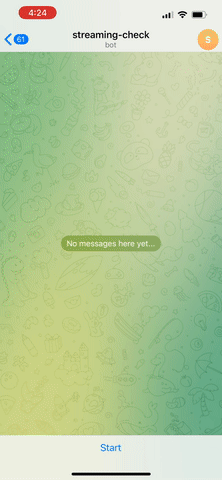

# Telegram Moviebot
### Chat-bot that tells you where to stream a movie.



Built using the wonderful [python-telegram-bot](https://github.com/python-telegram-bot/python-telegram-bot) library and the [TMDB](https://developers.themoviedb.org/3/getting-started/introduction) and [Streaming Availability](https://rapidapi.com/movie-of-the-night-movie-of-the-night-default/api/streaming-availability/details) APIs.

## Requirements
- [Streaming Availability API token](https://rapidapi.com/movie-of-the-night-movie-of-the-night-default/api/streaming-availability)
- [TMDB API token](https://developers.themoviedb.org/3/getting-started/introduction)
- [Telegram Bot Token](https://core.telegram.org/bots)
- Computer/VPS with an internet connection. No open ports required :)
  
## Getting Started

Regardless of how you run it, the program expects the above API tokens to be available as the below environment variables:  
- **SA_API_TOKEN**
- **TMDB_API_TOKEN**
- **TG_BOT_TOKEN**

### Docker
One-liner:  
```
docker run \ 
--env TMDB_API_TOKEN=$TMDB_API_TOKEN
--env SA_API_TOKEN=$SA_API_TOKEN
--env TG_BOT_TOKEN=$TG_BOT_TOKEN
skoobasteeve/telegram-moviebot:main
```
docker-compose:
```
---
version: 3
services:
  telegram-moviebot:
    container_name: telegram-moviebot
    image: skoobasteeve/telegram-moviebot:main
    environment:
      - TMDB_API_TOKEN=${TMDB_API_TOKEN} # Required
      - SA_API_TOKEN=${SA_API_TOKEN} # Required
      - TG_BOT_TOKEN=${TG_BOT_TOKEN} # Required
      - TG_BOT_USER= # (optional) Limits access to the bot to a single Telegram user
  restart: always
```
```
docker-compose up -d
```

### Run from source
Clone the repo
```
git clone https://github.com/skoobasteeve/telegram-moviebot.git
```
Install the dependencies
```
cd telegram-moviebot
```
```
pip install -r requirements.txt
```
Run the bot
```
python /telegram-moviebot/telegram-moviebot.py
2022-04-23 16:08:37,698 - apscheduler.scheduler - INFO - Scheduler started
2022-04-23 20:20:15,858 - __main__ - INFO - Looking up movie: "Star Wars"
2022-04-23 20:20:16,198 - __main__ - INFO - Result was a 100% match.
2022-04-23 20:20:16,203 - __main__ - INFO - Returning movie: "Star Wars: (1977)"
```

## How to use
Once your bot is set up, simply open a new conversation with the bot and type /start.  

Next, type the name of the movie you're looking for.  

Most of the time, you'll find your movie on the first try. However, you can further narrow your search by specifying the `-year` flag followed the the release year.  


